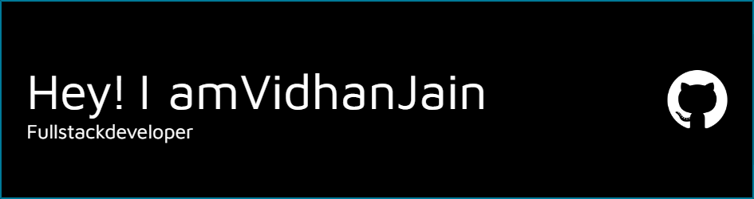

---

## 🚀 About Me
 
- 🔭 I’m currently working with MERN Stack
- 🌱 I’m diving deep into **Web Development**
- 👨‍💻 All of my projects are available at [Portfolio](https://portfolio-vidhanjain143s-projects.vercel.app/)
- 💌 How to reach me: <a href="mailto:vidhanjain143@gmail.com@gmail.com">vidhanjain143@gmail.com</a>

  

--- 

## 🌐 Let's Connect!

  
  

---

## 🛠️ Tech Stack

### Languages:

### Frameworks & Libraries:

### Tools & Platforms:

---
### Github Stats

  
  

---
### 📘Leetcode Stats

